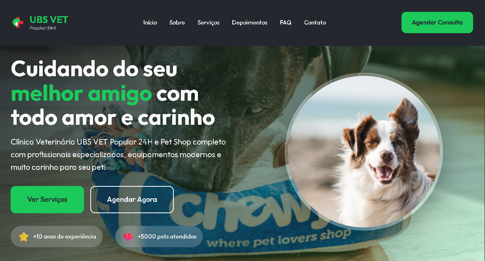

# 🏥 UBS VET Popular | Landing Page & Triagem Virtual

> Landing page moderna e sistema de triagem inteligente desenvolvido para a clínica veterinária **UBS VET Popular** (Belo Horizonte/MG).



---

## 🎨 Sobre o Projeto

Este projeto consiste em uma landing page responsiva e premium com tema **Dark Modern Neon** inspirada na fachada real da clínica UBS VET Popular. O site foi projetado para oferecer uma experiência de alto nível para os tutores de pets, integrando serviços de pet shop e clínica veterinária de forma intuitiva.

---

## 🚀 Principais Funcionalidades

1. **Juliana - Assistente Virtual (Triagem Local)**: 
   - Um chatbot local desenvolvido 100% em Vanilla JavaScript.
   - Conduz o tutor por um processo estruturado de triagem coletando: *Nome do Tutor, Nome do Pet, Raça, Idade e Sintomas*.
   - Analisa sintomas comuns (como vômito, diarreia, sangue, coceira, etc.) e fornece orientações de saúde preliminares automáticas.
2. **Integração Inteligente com WhatsApp**:
   - Ao final da triagem, a assistente formata todos os dados de forma legível e gera um link da API do WhatsApp.
   - Os botões de **"Agendar Consulta"** e **"Agendar Agora"** no cabeçalho e na seção principal abrem a assistente virtual diretamente para iniciar a triagem.
3. **Identidade Visual Neon Dark**:
   - Paleta de cores selecionada com HSL baseada na clínica real (Verde Neon de destaque e Vermelho Cruz).
   - Efeitos de brilho e reflexo neon com transições suaves sob interações do mouse (hover).
4. **Galeria de Fotos da Campanha de Frio**:
   - Um grid responsivo de imagens organizando fotos da campanha de frio, com efeitos interativos de escala e brilho neon.
5. **SEO & Otimização**:
   - Meta tags Open Graph configuradas para que o link exiba o preview e a logo corretamente quando compartilhado no WhatsApp.
   - Ícones vetorizados (SVG) para velocidade e escalabilidade de resolução.

---

## 🛠️ Tecnologias Utilizadas

- **HTML5**: Estrutura semântica e acessibilidade.
- **CSS3**: Layouts flexíveis com Flexbox e Grid, variáveis nativas (`:root`) e efeitos de animação/neon.
- **JavaScript (ES6+)**: Máquina de estados para a conversa, lógica de análise de sintomas por palavra-chave e manipulação dinâmica da DOM.

---

## 💻 Como Rodar o Projeto Localmente

1. Clone este repositório no seu computador:
   ```bash
   git clone https://github.com/Fred1416/ubs-vet-site.git
